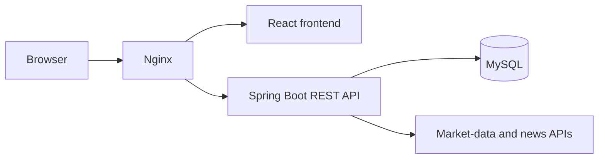
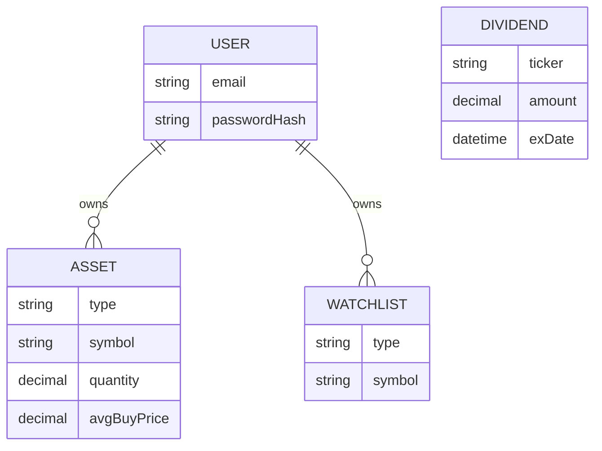
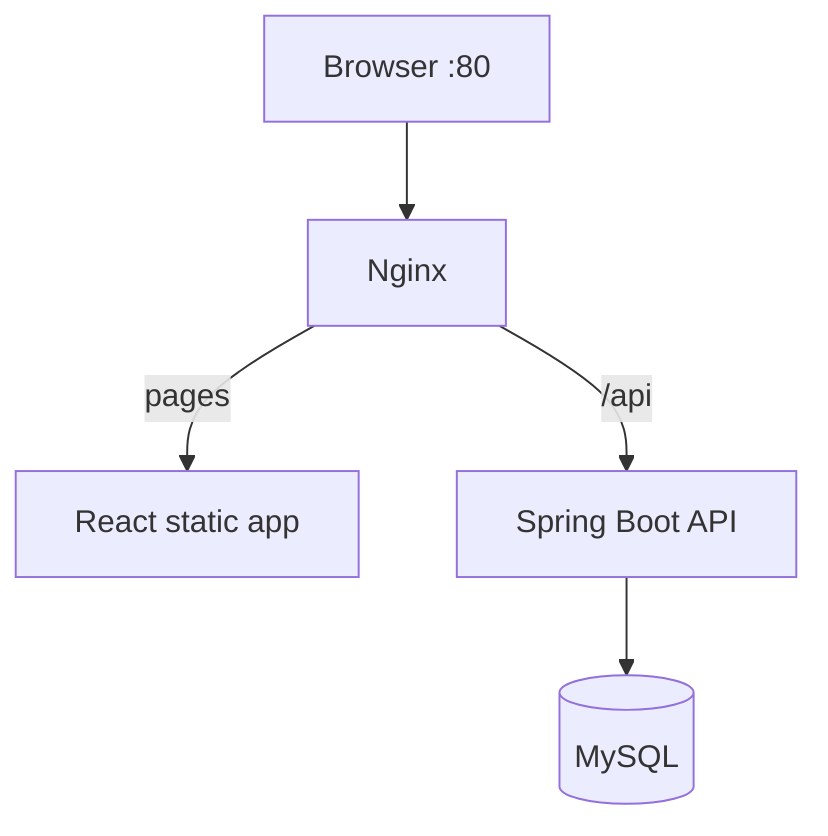

# FinVault — High-Level Design

This document explains the architecture of FinVault at a system level: the main components, how they talk to each other, and the important trade-offs. Setup and run instructions live in [README.md](README.md).

FinVault is a personal portfolio tracker. It is not a brokerage, trading platform, or source of financial advice.

## 1. Purpose

FinVault lets a registered user keep investment holdings in one place. The user can add assets, follow symbols on a watchlist, view calculated portfolio value and allocation, log dividend events, and read market news and sentiment.

The product problem is simple: holdings often sit in different apps or spreadsheets. FinVault gives one authenticated dashboard for record-keeping and market context. It is built as a student/portfolio full-stack project for personal use, not as a multi-user wealth platform.

## 2. Scope

**Included today**

- Browser React app and Spring Boot REST API

- MySQL storage for users, holdings, watchlist items, and dividend entries

- JWT login, BCrypt password hashing, and user-scoped access to assets and watchlist

- Portfolio totals calculated by the API from stored holdings

- Live price enrichment for stocks and crypto when external APIs respond

- Manual entry for mutual funds, real estate, fixed deposits, and cash

- Public market search, news, and sentiment, with labelled fallbacks if a provider fails

- Docker Compose deployment with Nginx as the reverse proxy

**Out of scope**

- Placing trades, linking brokerage accounts, or importing statements

- Payments, KYC, email/SMS delivery, or an admin console

- Accounting-grade returns, tax lots, or multi-currency conversion

- Multi-service or cloud-scale infrastructure

## 3. Technology Stack

| Layer | Choice |

| --- | --- |

| Frontend | React 18, Vite, Tailwind CSS, Recharts |

| Backend | Java 17, Spring Boot 3.3.2, Spring Security, Spring Data JPA |

| Database | MySQL 8.4 |

| Auth | JWT access tokens, BCrypt password hashes |

| Market data | Yahoo Finance (stocks), CoinGecko (crypto), Alpha Vantage (news/sentiment); NSE/BSE configured as optional |

| Packaging | Docker Compose and Nginx |

The backend is one Spring Boot application (a modular monolith). The frontend is a React single-page app. They communicate over REST with JSON.

## 4. Architecture Overview

How a request moves:

1. The browser loads the React app and calls `/api/...` with JSON.

2. In Docker, Nginx is the single entry point: UI files go to the React app, `/api/` goes to Spring Boot.

3. The API checks rate limits, authenticates the JWT when required, runs business logic, and reads or writes MySQL.

4. For prices, search, news, or sentiment, the API calls external providers. The browser never holds those API keys.

Portfolio math happens on the server. The React app displays the result; it does not own the calculation.

Local development uses the same idea without Nginx: Vite on port `5173`, API on `4000`, MySQL on `3306`.

## 5. Main Modules

**Authentication / identity.** Register and log in with email and password. The API returns a JWT. Password reset exists as a local flow; email delivery is not implemented.

**Holdings.** Create, read, update, and delete assets the current user owns. Supported types: stock, mutual fund, crypto, real estate, fixed deposit, and cash.

**Portfolio.** On read, the API loads that user's holdings, attaches stock/crypto prices when available, and returns market value, cost, P&L, and allocation.

**Watchlist.** Symbols the user follows, without a quantity. Each user may store a symbol only once.

**Dividends.** Manual calendar entries (ticker, amount, dates). Login is required, but records are not yet tied to a user.

**Market data.** Public search for stocks, crypto, and mutual funds. Live quotes are used for stocks and crypto; other types stay on user-entered values.

**News / sentiment.** Public headlines and a simple sentiment summary. If the provider fails, the API returns labelled fallback content instead of breaking the page.

**User profile.** The signed-in user can read and update their own profile fields.

Dashboard charts for performance history exist in the UI. They currently use generated demo data, not stored daily portfolio values.

## 6. Data Model

| Entity | What it stores | Important rule |

| --- | --- | --- |

| User | Account, password hash, reset-token state | Email is unique. Raw passwords are not stored. |

| Asset | One holding | Belongs to one user. |

| Watchlist | One followed symbol | Belongs to one user. Unique pair of user + symbol. |

| Dividend | One calendar event | **No user link yet.** Any authenticated caller can see the shared list. |

Portfolio totals are not a separate table. They are calculated when the summary is requested, from assets plus current or fallback prices.

## 7. Security

Kept to the controls that actually exist:

- **JWT authentication** for protected APIs. The token is sent as a bearer token. There is no server session store.

- **BCrypt password hashing** before a user is saved.

- **User-scoped database queries** for assets and watchlist, so one user cannot update another user's rows. The user id comes from the token, not from the request body.

- **API rate limiting** in memory, per client IP, meant for a single API process.

- **CORS** limited to known local origins.

- **Provider keys and DB passwords** stay on the server. The React app never sees them.

- **Safe API responses** omit password hashes. Logs record method, path, status, and duration, not secrets.

Password-reset tokens are time-limited. Returning a reset token in the API response is a local debug option and should stay off outside development.

Public routes: auth, news, search, contact, and basic health. Everything else requires a valid token.

## 8. External Integrations

External APIs enrich the dashboard. They are not a source of record and not a trading signal.

| Provider | Used for | If it fails |

| --- | --- | --- |

| Yahoo Finance | Stock search and quotes | Use fallback search/prices |

| CoinGecko | Crypto search and quotes | Use fallback crypto data |

| Alpha Vantage | News and sentiment | Return sample content marked as fallback |

| NSE / BSE | Optional Indian-market config | Core holdings still work without them |

Rules:

- Only the server calls providers.

- Adding or listing holdings must still work if a provider is down.

- Fallback responses are labelled so the UI does not present sample data as live.

## 9. Deployment

Docker Compose runs four pieces: Nginx on host port 80, the React static app, the Spring Boot API, and MySQL. Nginx is the only public HTTP port. MySQL is published on host port `3307` so it does not clash with a local database on `3306`.

Secrets (`JWT_SECRET`, database passwords) come from a local `.env` file that is not committed.

Without Docker, run MySQL, start the API with Maven, and start the Vite dev server. Same architecture, fewer containers.

## 10. Important Design Decisions

**One Spring Boot app instead of microservices.** Auth, holdings, and market calls share one process. The domain is small; extra services would add work without a real scale need.

**REST instead of GraphQL.** Assets, watchlist, and dividends map cleanly to resources. REST is enough for this UI.

**MySQL instead of a document store.** Users, holdings, and watchlist items are relational. Unique email and unique `(user, symbol)` are straightforward in SQL.

**JWT instead of server sessions.** The API stays stateless. The browser already sends an `Authorization` header. A session table or Redis is unnecessary for a single instance.

**Market APIs called from the server.** Keys stay off the client. The API can swap in fallback data in one place.

**Labelled fallbacks instead of failing the dashboard.** Record-keeping should survive a Yahoo or Alpha Vantage outage. The UI should still know when data is live vs sample.

**Nginx + Docker Compose.** One URL for the packaged app: UI and API share an origin, which keeps local CORS simple.

## 11. Limitations

These are current facts, not hidden bugs:

1. **Dividend rows are not user-scoped.** Login is required, but entries are global.

2. **Performance charts and snapshots use generated demo data**, not stored daily valuations.

3. **Password-reset email is simulated.** There is no mail provider.

4. **Rate limiting is in-memory.** It does not work correctly across more than one API instance.

5. **Schema updates use Hibernate `ddl-auto=update`.** There are no versioned Flyway/Liquibase migrations.

6. **Automated integration-test coverage is limited**, especially around cross-user access.

7. **Live prices cover stocks and crypto only.** Other asset types are manual.

8. **Billing is an example endpoint**, not a payment integration.

## 12. Future Improvements

These follow from the gaps above. They would stay inside the same React app + one API + MySQL shape:

- Attach dividends to a user and enforce the same ownership checks as assets

- Persist daily portfolio snapshots so charts use real history

- Send password-reset mail and never return the token in JSON

- Replace `ddl-auto=update` with versioned migrations

- Add API tests for invalid tokens and cross-user access

- Add more asset types with live prices when a reliable source exists

Larger ideas (broker sync, CSV import, MFA, shared rate limiting) are product follow-ups, not part of the current design.
